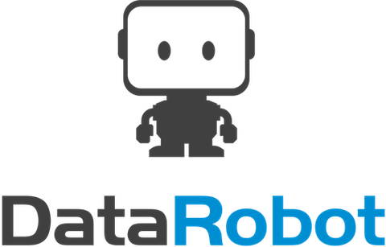
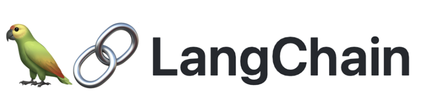
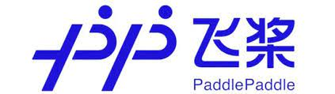

<h1> Hello! Nice to meet you!</h1>

<b> Welcome to my GitHub page!   My name is Titus and I'm a data scientist from  Singapore</b>

🏫 I’ve a Masters degree in Artificial Intelligence 👨‍🎓 but I'm forever playing catch-up with the rapidly developing field of data science 🤣. Nonetheless, those nights spent learning the fundamentals of AI (computer vision, natural language processing, recommender systems, machine learning, machine learning engineering, etc) were very memorable!  
👨🏻‍💻 This year, I've been dabbling in plenty of LLM application development. I enjoy building agents and agentic RAG systems!  
🌱 I’m currently learning more about full stack development to become a more complete developer - coding is so fun 👨‍💻!      
🚀 Check out my [personal webpage](https://tituslim.onrender.com/)!   

### Let's connect!:
[][linkedin]
 

### I code in:

 

### I use these database tools:

 

### I use these tools for Data Science:

 

  

### I use these tools for full stack development:

### I enjoy using these frameworks:

   

### <h3>Featured projects</h3>
<table>
  <thead align="center">
    <tr border: none;>
      <td><b>🎁 Projects</b></td>
      <td><b>📝 Summary</b></td>
      <td><b>⭐ Domains</b></td>
      <td><b>🛠️ Tools</b></td>
    </tr>
  </thead>
  <tbody>
    <tr>
      <td><a href="https://github.com/teyang-lau/you-only-edit-once"><b>You Only Edit Once</b></a></td>
      <td>Using object detection models to trim and beautify diving videos - feel free to try it out!
      </td>
      <td></td>
      <td>
         
        </td>
      </td>
    </tr>
    <tr>
      <td><a href="https://github.com/quekhyg/NLP-Lyric-Generator"><b>A Song for Singapore</b></a></td>
      <td>Using LSTM, GRU, Seq2Seq models and GPT-2 to write lyrics, melody, harmony and sing out Singapore's next national day song!</td>
      <td></td>
      <td>
      
      
      </td>
    </tr>
    <tr>
      <td><a href="https://github.com/teyang-lau/coffee-joint-rec-sys"><b>The Coffee Recommender System</b></a></td>
      <td>Using deep learning and collaborative filtering to develop Singapore's coffee recommendation system.</td>
      <td>
      
      </td>
      <td>
      </td>
    </tr>
    <tr>
      <td><a href="https://github.com/spencerkmarley/cs612-ai-sys-eval-project"><b>AI Backdoor Catcher</b></a></td>
      <td>Using neural cleansing, neural attention distillation and other advanced methods to identify backdoors embedded in AI models</td>
      <td>
      </td>
      <td></td>
    </tr>
    <tr>
      <td><a href="https://github.com/tituslhy/Face-mask-classification"><b>Face Mask Classification</b></a></td>
      <td>This was an attempt at developing and quantizing image classification models for deployment to edge device through GCP to support the government's COVID-19 face mask detection enforcement measures. </td>
      <td>
      </td>
      <td>
      </td>
    </tr>
    <tr>
      <td><a href="https://github.com/tituslhy/Skimlit"><b>Skimlit</b></a></td>
      <td>The aim of this project is to make chunky abstracts/summaries appear skimmable,and follows the experiments (and data) by the paper: [PubMed 200k RCT: a Dataset for Sequenctial Sentence Classification in Medical Abstracts](https://arxiv.org/abs/1710.06071). </td>
      <td>
      </td>
      <td>
      
      
      
      </td>
    </tr>
    <tr>
      <td><a href="https://github.com/tituslhy/FoodVision-Tensorflow"><b>FoodVision-Tensorflow</b></a></td>
      <td>This project is a personal project to develop a computer vision classification model for food images. </td>
      <td>
      </td>
      <td>
      
      </td>
    </tr>
    <tr>
      <td><a href="https://github.com/vannarath-poeu/aml-project"><b>Improving NYC 311 Efficiency</b></a></td>
      <td>Forecasting closure duration of 311 complaints to support NYC agencies in case prioritization</td>
      <td></td>
      <td>
      </td>
    </tr>
    <tr>
      <td><a href="https://medium.com/@yenjoon.tan.2020/the-iot-liquid-pipeline-monitoring-system-2c6e66d75b9d"><b>The IoT Liquid Pipeline Monitoring System</b></a></td>
      <td>Developing an entire proof-of-concept for IoT-driven pipelines using Arduino, SQL and Python.</td>
      <td></td>
      <td>
        
        
        
        
        
    </tr>
    
    
[linkedin]: https://www.linkedin.com/in/titus-lim-hsien-yong/
