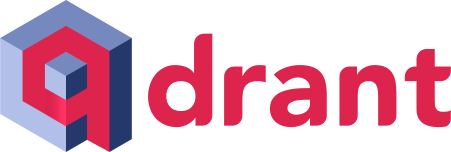
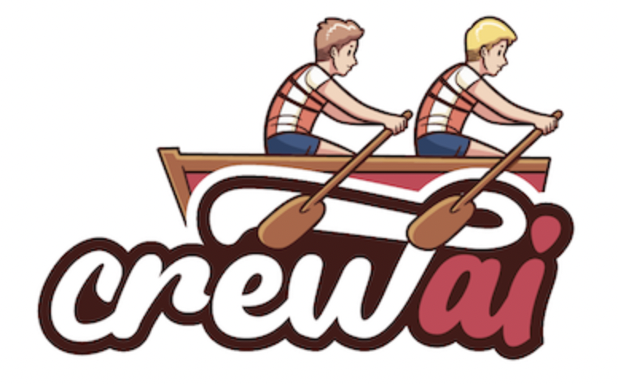

<h1> Hello! Nice to meet you!</h1>

<b> Welcome to my GitHub page!   My name is Titus and I'm a data scientist from  Singapore&nbsp;&nbsp;&nbsp;&nbsp;</b>

🏫 I’ve a Masters degree in Artificial Intelligence 👨‍🎓 but I'm forever playing catch-up with the rapidly developing field of data science 🤣. Nonetheless, those nights spent learning the fundamentals of AI (computer vision, natural language processing, recommender systems, machine learning, machine learning engineering, etc) were very memorable!  
🤖  I genuinely enjoy building LLM applications (agents, agentic RAG systems, etc.) and basically live on the Llamaindex / Langchain / Chainlit / Autogen / CrewAI's documentation pages!  
✍️  I author and publish [medium articles](https://medium.com/@tituslhy) on generative AI frameworks for fun! I've published 40 articles so far!    
🦾  I'm also a citizen RPA developer. UiPath is awesome!     
🌱 I’m hoping to learn more about: 
<ol>
  <li>
    Java - because almost every company uses Java ♨️!  
    .svg"> 
    
    
  </li>
   
  <li>
    Full stack development to become a more complete developer - coding is so fun 👨‍💻!  
    .svg"> 
    
    
    
    
  </li>
   
  <li>
    Data engineering - Developing robust data pipelines 🛠️!  
    .svg"> 
    
    
    
    
    
  </li>
   
  <li>
    Quantum Computing - I believe it's the future and it's coming sooner than we think! ⚛ 
     
    
  </li>
</ol>

<table>
  <tr>
    <td style="background-color: #c2c0c0; padding: 10px; border-radius: 5px;">
      <h3>🚀 Check out my <a href="https://tituslim.onrender.com/">personal webpage</a>!</h3>
    </td>
  </tr>
  <tr>
    <td style="background-color:rgb(12, 12, 12); padding: 10px; border-radius: 5px;">
      <h3><a href="https://www.linkedin.com/in/titus-lim-hsien-yong/">Let's connect! </a></h3>
    </td>
  </tr>
</table>

## My Tech Stack

### I code in:

 

### I use these tools and frameworks:

<table>
  <thead>
    <tr>
      <th>Category</th>
      <th>Tools</th>
    </tr>
  </thead>
  <tbody>
    <tr>
      <td><b>☁️ Platforms</b></td>
      <td>
        
        
        
        
        
        
      </td>
    </tr>
    <tr>
      <td><b>🖼️ Frontend</b></td>
      <td>
        
          
        
        
        
        
      </td>
    </tr>
    <tr>
      <td><b>🛠️ Backend</b></td>
      <td>
        
        
      </td>
    </tr>
    <tr>
      <td><b>⛁ Databases</b></td>
      <td>
        
        
        
        
        
        
        
        
      </td>
    </tr>
    <tr>
      <td><b>🤖 AI Frameworks</b></td>
      <td>
        
        
        
        
        
        
        
        
        
        
          
        
        
        
        
      </td>
    </tr>
    <tr>
      <td><b>🧮 Optimization / Modeling</b></td>
      <td>
        
      </td>
    </tr>
    <tr>
      <td><b>🧰 DevOps & MLOps</b></td>
      <td>
        
        
        
        
        
        
        
         
        
      </td>
    </tr>
    <tr>
      <td><b>🗄️ Servers</b></td>
      <td>
        
      </td>
    </tr>
    <tr>
      <td><b>🖥️ Infrastructure & Monitoring</b></td>
      <td>
        
        
        
      </td>
    </tr>
    <tr>
      <td><b>🧱 Data Engineering</b></td>
      <td>
         
        
      </td>
    </tr>
    <tr>
      <td><b>⚙️ Automation</b></td>
      <td>
         
        
      </td>
    </tr>
    <tr>
      <td><b>📡 IoT</b></td>
      <td>
        
        
      </td>
    </tr>
    <tr>
      <td><b>📊 Business Intelligence</b></td>
      <td>
        
      </td>
    </tr>

  </tbody>
</table>

### <h3>Featured projects</h3>
<table>
  <thead align="center">
    <tr border: none;>
      <td><b>🎁 Projects</b></td>
      <td><b>📝 Summary</b></td>
      <td><b>⭐ Domains</b></td>
      <td><b>🛠️ Tools</b></td>
    </tr>
  </thead>
  <tbody>
    <tr>
      <td><a href="https://github.com/tituslhy/TheMarginCall"><b>The Margin Call</b></a></td>
      <td>LLMs for investing - technical analysis, fundamental analysis, AutoRAG, online research and AutoML to forecast stock prices</td>
      <td>
         
         
         
      </td>
      <td style="text-align: left;">
        
        
        
        
      </td>
    </tr>
    <tr>
      <td><a href="https://github.com/tituslhy/literate-octo-tribble"><b>A Gentle Introduction to the LLM Multiverse</b></a></td>
      <td>The GitHub repository used for all Medium articles introducing LLM frameworks</td>
      <td>
         
         
      </td>
      <td style="text-align: left;">
         
         
          
          
         
           
         
         
         
         
         
      </td>
    </tr>
    <tr>
      <td><a href="https://github.com/teyang-lau/you-only-edit-once"><b>You Only Edit Once</b></a></td>
      <td>Using object detection models to trim and beautify diving videos - feel free to try it out!
      </td>
      <td></td>
      <td style="text-align: left;">
        
        
        </td>
      </td>
    </tr>
    <tr>
      <td><a href="https://github.com/quekhyg/NLP-Lyric-Generator"><b>A Song for Singapore</b></a></td>
      <td>Using LSTM, GRU, Seq2Seq models and GPT-2 to write lyrics, melody, harmony and sing out Singapore's next national day song!</td>
      <td></td>
      <td>
        
        
        
      </td>
    </tr>
    <tr>
      <td><a href="https://github.com/teyang-lau/coffee-joint-rec-sys"><b>The Coffee Recommender System</b></a></td>
      <td>Using deep learning and collaborative filtering to develop Singapore's coffee recommendation system.</td>
      <td>
      
      </td>
      <td style="text-align: left;">
        
        
      </td>
    </tr>
    <tr>
      <td><a href="https://github.com/spencerkmarley/cs612-ai-sys-eval-project"><b>AI Backdoor Catcher</b></a></td>
      <td>Using neural cleansing, neural attention distillation and other advanced methods to identify backdoors embedded in AI models</td>
      <td>
      </td>
      <td></td>
    </tr>
    <tr>
      <td><a href="https://github.com/tituslhy/Face-mask-classification"><b>Face Mask Classification</b></a></td>
      <td>This was an attempt at developing and quantizing image classification models for deployment to edge device through GCP to support the government's COVID-19 face mask detection enforcement measures. </td>
      <td>
      </td>
      <td style="text-align: left;">
        
        </td>
      </td>
    </tr>
    <tr>
      <td><a href="https://github.com/tituslhy/Skimlit"><b>Skimlit</b></a></td>
      <td>The aim of this project is to make chunky abstracts/summaries appear skimmable,and follows the experiments (and data) by the paper: [PubMed 200k RCT: a Dataset for Sequenctial Sentence Classification in Medical Abstracts](https://arxiv.org/abs/1710.06071). </td>
      <td>
      </td>
      <td style="text-align: left;">
         
         
         
      </td>
    </tr>
    <tr>
      <td><a href="https://github.com/tituslhy/FoodVision-Tensorflow"><b>FoodVision-Tensorflow</b></a></td>
      <td>This project is a personal project to develop a computer vision classification model for food images. </td>
      <td>
      </td>
      <td>
      
      </td>
    </tr>
    <tr>
      <td><a href="https://github.com/vannarath-poeu/aml-project"><b>Improving NYC 311 Efficiency</b></a></td>
      <td>Forecasting closure duration of 311 complaints to support NYC agencies in case prioritization</td>
      <td>
         
         
      </td>
      <td style="text-align: left;">
         
         
      </td>
    </tr>
    <tr>
      <td><a href="https://medium.com/@yenjoon.tan.2020/the-iot-liquid-pipeline-monitoring-system-2c6e66d75b9d"><b>The IoT Liquid Pipeline Monitoring System</b></a></td>
      <td>Developing an entire proof-of-concept for IoT-driven pipelines using Arduino, SQL and Python.</td>
      <td></td>
      <td>
         
         
         
         
    </tr>
    
    
[linkedin]: https://www.linkedin.com/in/titus-lim-hsien-yong/
